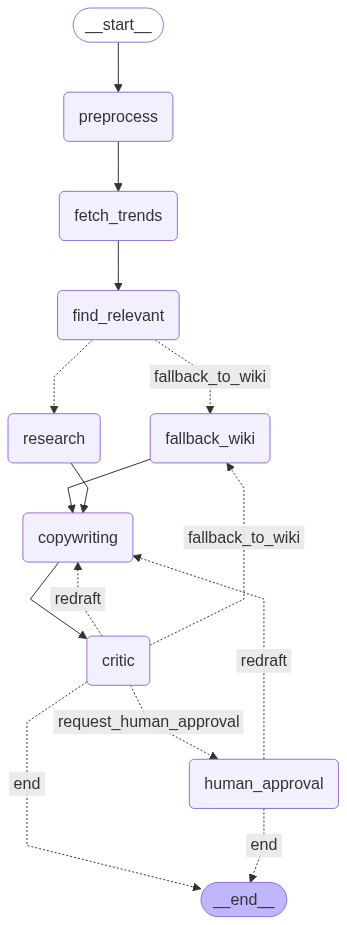

# Social-Media-Trend-Agent-Case-Study-MBA:Autonomous Content Generation Agent

### A Note on the Implementation

My implementation realizes the assignment's core concepts within a dynamic, end-to-end application:
*   The assignment's **"Research Step"** is realized in my code as a dynamic pipeline that first consults Google Trends and intelligently falls back to Wikipedia.
*   The **"Critique & Refine"** loop is powered by the `critic_node` and a conditional edge that forces revisions based on AI feedback.
*   The **"Human-in-the-Loop"** gate is managed by the `human_approval_node`, which pauses the entire process to await final sign-off.

This README documents the resulting project.

---

## Project Overview

This project is an autonomous agent designed to take a user's natural language request, conduct research on real-time trends, write a draft article, and refine it through a cycle of AI-powered critiques and human approval.

It demonstrates a robust, multi-path workflow that can dynamically adapt its research strategy based on the availability of relevant, timely data.

### Features
-   **Autonomous Research**: Automatically fetches and analyzes real-time data from Google Trends [[https://trends.google.com/trending?geo=DE&hl=en-US]].
-   **Dynamic Fallback Mechanism**: If no relevant trends are found, it seamlessly switches to a fallback research strategy using Wikipedia.
-   **AI-Powered Revision Loop**: An AI critic reviews the draft and provides actionable feedback. The agent can revise its own work to improve quality.
-   **Human-in-the-Loop**: The final draft is presented to a human for approval, ensuring final control and quality assurance.
-   **Multi-Language Support**: Can understand requests and generate content in multiple languages.
-   **[Optional] LangSmith Tracing**: Full integration with LangSmith for detailed execution tracing and debugging.

### Architecture & Workflow

The agent is implemented as a State Graph using `LangGraph`. The `AgentState` object acts as a shared memory that is passed and modified between nodes, ensuring context is maintained throughout the process.


---

## Getting Started

### 1. Installation
Clone the repository, create and activate a virtual environment, and install the required dependencies.

```bash
# Create and activate virtual environment
python3 -m venv venv
source venv/bin/activate

# Install packages
pip install langgraph langchain langchain-google-genai langchain-community feedparser python-dotenv wikipedia
```

### 2. Configuration
At `.env` file in the project root. This file will store your secret API keys.
```
GOOGLE_API_KEY="YOUR_GOOGLE_API_KEY_HERE"
# Optional: For LangSmith Tracing
LANGCHAIN_TRACING_V2="true"
LANGCHAIN_API_KEY="YOUR_LANGSMITH_API_KEY_HERE"
```

### 3. Usage
Run the script from your terminal:
```bash
python your_script_name.py
```
The agent will run the workflow. When it produces a satisfactory draft, it will pause for your approval. Resume the process by providing `y` or `n` in the terminal.

---

## In-Depth: Answers to Assignment Questions

### 1. What is one major limitation of the "Critique & Refine" loop you built, and how might you address it in a production system?

A major limitation is the risk of getting stuck in an **infinite loop** or a **degradation loop**. The agent might repeatedly generate and critique posts without ever reaching a satisfactory state, or the "refinements" might even make the post worse. Each cycle costs time and money (LLM API calls).

**Production Solution:** The assignment prompt wisely highlights this risk. Taking that suggestion to heart, I proactively implemented a solution in my code to make the agent more robust:
*   **Maximum Iteration Counter:** I added a `fail_count: int` to the `AgentState` and two global constants, `MAX_FAILS` and `MAX_TOTAL`.
*   In the conditional edge `after_critic_decide_next_step`, the agent checks this counter. If `fail_count` exceeds `MAX_FAILS` (e.g., 3 revisions), it breaks the loop and forces a new research attempt from the fallback node to get fresh material. If the total number of attempts exceeds `MAX_TOTAL`, the graph terminates to prevent runaway costs.

### 2. Why is managing the `AgentState` so critical in a cyclical graph like this one?

In a cyclical graph, `AgentState` is critical because it's the **sole mechanism for communication and context preservation across iterations**.

1.  **Passing Feedback:** The state is how the `critic_node` passes its findings (the `critiques` list) back to the `copywriting_node`. Without the state, the copywriting node would have no memory of *why* it needs to revise the draft.
2.  **Maintaining Global Context:** The state holds the original `request` and `research_findings` constant throughout all loops. This ensures that even after multiple refinement cycles, the agent doesn't suffer from "context drift" and forget its primary objective.
3.  **Preventing State Pollution:** LangGraph's state management ensures updates are handled cleanly. In my code, after a revision, the `critiques` field is reset to `None`. This is crucial to prevent old critiques from a previous failed cycle from incorrectly influencing a future revision cycle.

---

## Future Roadmap & Broader Vision

This agent is a strong foundation. Here’s how I see it evolving into a production-grade asset.

#### Immediate Enhancements
1.  **Expand Research Capabilities:** To improve the hit rate of finding relevant trends, we can integrate other real-time data sources (e.g., News APIs) and replace the basic Wikipedia tool with an advanced web search tool (e.g., Tavily, Bing Search) for richer, more timely context.
2.  **Refine the Critique Process:** Beyond the LLM's general judgment, we can add explicit, measurable rules to the `critic_node`. For example, we could enforce business logic such as, "The post must be under 100 words," or "The post must include a call-to-action."
3.  **Optimize for Performance and Cost:** Fortunately, the observability provided by **LangSmith** makes this a data-driven process. We can track and optimize for key metrics:
    *   **Latency:** Analyze which nodes are bottlenecks and optimize their prompts or logic.
    *   **Token Costs:** Review traces to identify overly verbose steps and refine prompts to be more concise.
    *   **Prompt Effectiveness:** A/B test different prompt strategies to improve the quality of generated content and critiques.

#### From Prototype to Product: A Deployment Vision
While this project currently runs as a command-line application, its architecture is designed for growth. The natural next step is to wrap the LangGraph agent in a **FastAPI backend**, creating RESTful endpoints for generating content. This API would connect to a database for storing user requests and generated articles, and could be consumed by a simple frontend application.

I am proficient in containerizing applications with **Docker** and deploying them on major **cloud platforms** (like AWS, GCP, or Azure). Although this project didn't require showcasing these skills, I am excited by the prospect of taking a powerful prototype like this to a fully realized, scalable product.
